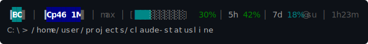
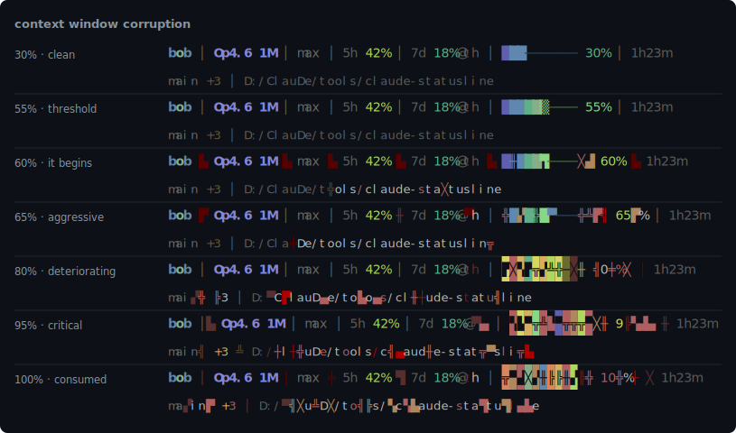

# Claude Code Rainbow Status Line

A colorful, information-dense status line for [Claude Code](https://claude.ai/code).



## Layout

Two lines. Line 1 is the dashboard, line 2 is where you are.

```
Bob │ Op4.6 1M │ max │ 5h 7%8p │ 7d 52%fr11a │ ██████──── 58%
main │ F:/Claude/products/fieldLog
```

### Line 1

| Section | Description |
|---------|-------------|
| `Bob` | First 3 chars of the active Claude account email — each char gets a unique color from a 43-color palette derived from the SHIFT + buddy palettes |
| `Op4.6 1M` | Model abbreviation + context window size — bold tier color (Opus violet, Sonnet blue, Haiku lime; 1M brighter than 200k) |
| `max` | Effort level (shown only if exposed in statusline data) |
| `5h 7%8p` | 5-hour rate limit % + reset time hint |
| `7d 52%fr11a` | 7-day rate limit % + reset time hint |
| `██████──── 58%` | Context window usage bar + percentage (rightmost) — shaded fill, cyan-to-red gradient |

### Line 2

| Section | Description |
|---------|-------------|
| `main` | Git branch (omitted if not in a git repo) |
| `F:/Claude/...` | Working directory — full path up to 75 chars, then truncated |

The account prefix lets you tell at a glance which account a Claude Code session is signed into when you run multiple accounts side-by-side via `CLAUDE_CONFIG_DIR`. The script reads `emailAddress` from `.claude.json` (checking both inside `CLAUDE_CONFIG_DIR` and one level up) and falls back silently if no email is found.

### Path truncation

Paths under 75 characters are shown in full. Longer paths truncate to:

```
F:/Cl.../products/fieldLog/src/components
```

The format is `{drive}:/{first-2-chars}.../{trailing segments}`, filling from the right until the 75-character budget is spent.

### Reset time format

| Format | Meaning |
|--------|---------|
| `5p` | Resets at 5 PM today |
| `mo9a` | Resets Monday at 9 AM |

### Model abbreviations

| Model | Abbreviation |
|-------|-------------|
| Claude Opus 4.6 | `Op4.6` |
| Claude Opus 4.5 | `Op4.5` |
| Claude Sonnet 4.6 | `So4.6` |
| Claude Sonnet 4.5 | `So4.5` |
| Claude Sonnet 4.0 | `So4` |
| Claude Haiku 4.5 | `Ha4.5` |
| Claude Haiku 3.5 | `Ha3.5` |

## Context corruption

As the context window fills past 55%, the status bar progressively self-destructs. The bar cells mutate into random block and line-drawing characters, colors wobble, glitch characters leak past the bar boundary and start consuming the model name and separators. Rate limit percentages are never touched — you can always read your actual usage.



| Range | What happens |
|-------|-------------|
| 0–55% | Clean, normal rendering |
| 55–60% | Bar cells start flickering to glitch characters |
| 60–65% | Color wobble, overflow chars leak past bar |
| 65–80% | Reverse video on bar cells, separators degrading, line 1 parts visibly corrupted |
| 80–95% | Bar is mostly unrecognizable, glitch chars infest everything, separators mutate independently |
| 95–100% | The statusline has been consumed. Only the rate limit percentages survive. |

The corruption is seeded from the current timestamp, so the glitch pattern shifts on every render — it looks alive. Line 2 (branch + path) corrupts at a gentler level so you can still find your way home.

## Requirements

- Claude Code v2.1+
- Python 3.6+ on PATH
- Bash
- Git (for branch display — gracefully omitted if unavailable)

Works on Windows (Git Bash or WSL), macOS, and Linux.

## Install

```bash
git clone https://github.com/thereprocase/claude-statusline.git
cd claude-statusline
bash install.sh
```

Then restart Claude Code.

## Uninstall

```bash
cd claude-statusline
bash uninstall.sh
```

## Manual install

1. Copy `statusline-command.sh` to `~/.claude/statusline-command.sh`
2. `chmod +x ~/.claude/statusline-command.sh`
3. Add to `~/.claude/settings.json`:

```json
{
  "statusLine": {
    "type": "command",
    "command": "bash ~/.claude/statusline-command.sh"
  }
}
```

4. Restart Claude Code.

## Files created

| File | Purpose |
|------|---------|
| `~/.claude/statusline-command.sh` | The status line script |
| `~/.claude/statusline-state.json` | Tracks rate limit state between invocations |
| `~/.claude/rate-limit-log.jsonl` | Persistent log of rate limit threshold crossings (auto-rotated at 2 months) |

## Rate limit logging

The status line logs a threshold crossing event to `~/.claude/rate-limit-log.jsonl` when either the 5-hour or 7-day rate limit window reaches **≥95%**. Each entry includes the model family, window type (`five_hour` or `seven_day`), the percentage, and the reset timestamp. Entries older than 60 days are automatically pruned when the log exceeds 4 KB.

This log file is consumed by [claude-usage](https://github.com/thereprocase/claude-usage) to render rate limit markers on its 90-day heatmap:
- **▲** (red) on days with a 5-hour spike
- **▼** (magenta) on weeks with a weekly limit breach

If you don't use claude-usage, the log file is harmless — it grows slowly (one entry per threshold crossing) and can be safely deleted.

## Known limitations

**Bash required.** The script uses `<<< here-string` syntax, which is a bashism. It will fail under `/bin/sh` on strict systems. The shebang is `#!/usr/bin/env bash` — as long as bash is on PATH, it works. On Windows, run it via Git Bash or WSL; the Claude Code `settings.json` command should be `bash ~/.claude/statusline-command.sh`, not `sh`.

**Git subprocess on every refresh.** The git branch display calls `git rev-parse` on each render. This is fast (<100ms) with a 2-second timeout safety net, but adds a subprocess spawn per refresh.

**Regenerating renders.** Run `python generate-renders.py` to regenerate the SVG images in `images/`. Requires the statusline script and bash on PATH.

**Unicode block characters.** The bar uses Unicode block elements (U+2588, U+258x series) and separator (U+2502). These render correctly in most modern terminals. If you see garbled characters, your terminal font doesn't cover the Block Elements or Box Drawing Unicode blocks — switch to a font like JetBrains Mono, Cascadia Code, or any Nerd Font.

## License

MIT
